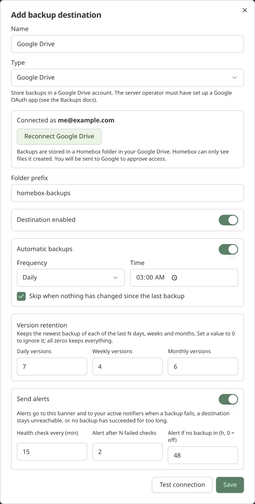

Homebox can back up a collection on a schedule, keep several versions, and write them to a destination of your choice.
Everything is managed by **collection owners** under **Collection → Tools → Backup & Restore**.

A backup is the same zip archive a manual export produces: every entity, tag, custom field, attachment, maintenance
record and notifier in the collection. Restore it with **Upload & Restore** into an empty collection.

> [!NOTE]
> Manual backups (**Start Backup**) still go to the [primary storage](./storage) and are removed after 7 days.
> Backups made by a destination are kept according to that destination's retention policy instead.


## Destinations

A destination is a place to write backups to, together with its own schedule, retention, health check and alert
settings. A collection can have up to 20.

| Type                 | Where backups go                                                                 | Credentials                                           |
|----------------------|----------------------------------------------------------------------------------|-------------------------------------------------------|
| Primary storage      | The instance's main storage (`HBOX_STORAGE_CONN_STRING`), next to attachments.   | None needed.                                          |
| Local directory      | A sub-folder of `HBOX_BACKUP_LOCAL_ROOT`, for example a mounted NAS share.       | None needed.                                          |
| S3-compatible        | An `s3://bucket?...` URL: AWS, MinIO, Backblaze B2, Cloudflare R2 and similar.   | `AWS_ACCESS_KEY_ID` and `AWS_SECRET_ACCESS_KEY`       |
| Google Cloud Storage | A `gcs://bucket` URL.                                                            | `GOOGLE_APPLICATION_CREDENTIALS`                      |
| Azure Blob           | An `azblob://container` URL.                                                     | `AZURE_STORAGE_ACCOUNT` and `AZURE_STORAGE_KEY`       |
| SFTP                 | A folder on any SSH server: TrueNAS, Unraid, Synology, a Linux box.              | Username and password or key, stored encrypted        |
| WebDAV               | A WebDAV share: Nextcloud, ownCloud, Synology, an Apache or nginx DAV folder.    | Username and password, stored encrypted               |
| Google Drive         | A folder in a Google account's Drive.                                            | The account is connected in the browser (OAuth)       |
| OneDrive             | The Homebox app folder in a Microsoft account's OneDrive.                        | The account is connected in the browser (OAuth)       |
| Dropbox              | A folder in a Dropbox account.                                                   | The account is connected in the browser (OAuth)       |

The cloud types use the same connection strings and parameters as [Storage](./storage), including `endpoint`,
`region` and `use_path_style` for S3-compatible servers.

> [!IMPORTANT]
> The S3, Google Cloud Storage and Azure types never store credentials: they read them from the server's environment, and
> a connection string that embeds a username or password is rejected. Only SFTP and WebDAV store a login, and they store
> it encrypted (see below).

### SFTP and WebDAV

These two types need a login, so they are only available once you set an encryption key:

```yaml
services:
  homebox:
    environment:
      # openssl rand -base64 32
      HBOX_BACKUP_ENCRYPTION_KEY: "<generated key>"
```

Passwords and private keys are sealed with AES-256-GCM before they are saved, are bound to their destination, and are
never returned by the API or shown again. **Keep the key stable and backed up separately**: if it changes, stored logins
can no longer be read and you will need to re-enter them.

- **Address**: `sftp://host[:port]/path` for SFTP, or the full `https://host/path/` URL for WebDAV. Put the username in its
  own field, not in the URL.
- **SFTP host key**: to make sure backups are only sent to your server, an SFTP destination is pinned to the server's SSH
  host key. Click **Test connection** once. Homebox shows the fingerprint the server presented. Compare it with your server
  (`ssh-keygen -lf /etc/ssh/ssh_host_ed25519_key.pub`), then click **Trust this host key**. If the key ever changes, the
  destination goes unreachable instead of silently trusting the new one.
- **Private key**: SFTP also accepts an unencrypted PEM private key instead of a password.
- **Changing a destination**: saved credentials are only kept while the type, address and username stay the same.
  Otherwise you must enter them again, so a destination can't be re-pointed at another server to collect them.

Uploads are written to a temporary `.part` file and renamed when complete, so a half-finished backup never looks like a
good one.


### Cloud drives (Google Drive, OneDrive, Dropbox)

Cloud drives use OAuth, so you sign in to the provider in a pop-up window and Homebox never sees your password. It keeps
only a **refresh token**, sealed with the encryption key, and asks for the narrowest access each provider offers:
Google's `drive.file` (only files Homebox created), OneDrive's app folder, and Dropbox's app folder.

A provider only appears in the destination form once the server operator has registered an OAuth app for it. This is a
one-time setup per provider, and you need `HBOX_BACKUP_ENCRYPTION_KEY` as well:

1. Create the app at the provider (see below) and add this **redirect URI**, using the address you reach Homebox on:
   `https://homebox.example.com/api/v1/group/backup-oauth/callback`
2. Set the app's ID and secret as environment variables, and set `HBOX_OPTIONS_HOSTNAME` (or `HBOX_OPTIONS_TRUST_PROXY`
   behind a proxy) so the redirect URI Homebox sends matches the one you registered.

| Provider    | Variables                                                                                              |
|-------------|--------------------------------------------------------------------------------------------------------|
| Google      | `HBOX_BACKUP_GOOGLE_CLIENT_ID`, `HBOX_BACKUP_GOOGLE_CLIENT_SECRET`                                      |
| Microsoft   | `HBOX_BACKUP_MICROSOFT_CLIENT_ID`, `HBOX_BACKUP_MICROSOFT_CLIENT_SECRET`, `HBOX_BACKUP_MICROSOFT_TENANT` |
| Dropbox     | `HBOX_BACKUP_DROPBOX_CLIENT_ID`, `HBOX_BACKUP_DROPBOX_CLIENT_SECRET`                                    |

**Google.** In the Google Cloud console, enable the *Google Drive API*, configure the OAuth consent screen, and create an
*OAuth client ID* of type *Web application* with the redirect URI above. Add the `.../auth/drive.file` scope. Publish the
consent screen ("In production"): while it is in *Testing*, Google expires refresh tokens after 7 days and backups would
stop. `drive.file` is a non-sensitive scope, so no Google verification review is needed.

**Microsoft.** In the Microsoft Entra admin center, register an application. Choose the supported account types you want
(personal and work accounts, or just one), add a *Web* redirect URI, and create a client secret. Under API permissions add
the delegated Microsoft Graph permissions `Files.ReadWrite.AppFolder` and `offline_access`. Leave
`HBOX_BACKUP_MICROSOFT_TENANT` as `common` to allow any account, or set a tenant ID, `consumers` or `organizations`. Client
secrets expire (at most after 24 months), so renew yours before then.

**Dropbox.** In the Dropbox App Console, create a *Scoped access* app with the *App folder* access type. On the
Permissions tab enable `files.content.write`, `files.content.read` and `account_info.read`, and on the Settings tab add the
redirect URI.

To add a destination, pick the provider, click **Connect**, approve access in the pop-up, then **Test connection** and
**Save**. Use **Reconnect** if you want a different account or access was revoked.



If the account's access is revoked, the destination becomes unreachable and the usual alert is sent. Edit it and
reconnect. Some providers (Microsoft) issue a new refresh token each time one is used; Homebox stores the new one
automatically.

> [!NOTE]
> The connection pop-up stays open only while you approve access, and the sign-in is held in the server's memory for
> 10 minutes. If you run several Homebox replicas behind a load balancer, make sure a connection attempt reaches the same
> instance for both steps.

### Using a NAS (TrueNAS, Unraid, Synology)

The simplest option is an **SFTP** destination pointing at a dataset on the NAS (enable the SSH service and give a user
write access). **WebDAV** and **S3-compatible** (MinIO) work as well.

If you would rather use a share you already mount (NFS or SMB), make it available to the container and point
`HBOX_BACKUP_LOCAL_ROOT` at it:

```yaml
services:
  homebox:
    environment:
      HBOX_BACKUP_LOCAL_ROOT: /backups
    volumes:
      - /mnt/truenas/homebox-backups:/backups
```

Then add a **Local directory** destination and enter a folder name such as `daily`. Backups are written to
`/backups/daily/`. Folder names cannot leave the backup root.

## Schedule

Turn on **Automatic backups** for a destination and choose how often it runs:

- **Hourly**: every N hours, at a chosen minute.
- **Daily**: at a chosen time.
- **Weekly**: on a chosen weekday and time.
- **Monthly**: on a chosen day (1 to 28) and time.

Times use the server's time zone (set `TZ` in the container to change it).

By default a scheduled run is **skipped when nothing has changed** since the last successful backup. Homebox compares a
fingerprint of the collection's data and settings (row counts and the newest change in every backed-up table), so edits,
additions and deletions are all detected. A skipped run is shown as "Last skipped". **Back up now** always runs.

## Versions and retention

Every run writes a new timestamped archive, so nothing is overwritten. The **Versions** list for a destination lets you
download or delete each one.

Retention keeps the newest backup of each of the last N days, weeks and months. For example `7 / 4 / 6` keeps up to
seven daily, four weekly and six monthly backups. A value of `0` ignores that period, and all zeros keeps everything.
The newest backup is always kept. Pruning runs after each successful backup and deletes the file before its history row.
Failed attempts are listed for 14 days.

## Health checks and alerts

Each destination is probed on its own interval (15 minutes by default) by writing and deleting a 1 KB test object. Use
**Test connection**, in the add or edit dialog or on a saved destination, to run the same probe on demand.

Alerts are sent once per problem, not repeatedly, and a recovery notice follows:

- a backup fails
- a destination fails the configured number of consecutive health checks
- no backup has succeeded for the configured number of hours (set `0` to turn this off)

Problems also show as a banner above the destination list. Messages go to the collection's active
[Notifiers](/user-guide/notifiers/).

> [!NOTE]
> Alerts use the normal notifier network rules. If your notification server is on your LAN, you may need to allow it with
> `HBOX_NOTIFIER_ALLOW_NETS` or the `HBOX_NOTIFIER_BLOCK_*` settings.

## Settings

| Variable                             | Default | Description                                                                                  |
|--------------------------------------|---------|----------------------------------------------------------------------------------------------|
| `HBOX_BACKUP_ENABLED`                | `true`  | Turns destinations, the scheduler and health checks on or off. Manual exports are unaffected. |
| `HBOX_BACKUP_LOCAL_ROOT`             |         | Directory local destinations live under. Empty disables local destinations.                  |
| `HBOX_BACKUP_ALLOW_CUSTOM_ENDPOINTS` | `true`  | Allow cloud URLs with a custom `endpoint`, and SFTP/WebDAV servers. Turn off to restrict to default provider endpoints. |
| `HBOX_BACKUP_ENCRYPTION_KEY`         |         | Seals SFTP, WebDAV and cloud-drive logins at rest. Required for those types. Keep it stable. |
| `HBOX_BACKUP_GOOGLE_CLIENT_ID` / `_SECRET` |   | OAuth app for Google Drive destinations.                                                     |
| `HBOX_BACKUP_MICROSOFT_CLIENT_ID` / `_SECRET` / `_TENANT` | `common` for the tenant | OAuth app for OneDrive destinations.                              |
| `HBOX_BACKUP_DROPBOX_CLIENT_ID` / `_SECRET` |  | OAuth app for Dropbox destinations.                                                          |

## Limits

- Deleting a destination removes it and its history, but **does not delete files** already written to it.
- Native SMB/NFS is not supported. Mount an SMB/NFS share and use a local directory, or use SFTP or WebDAV. See the
  [discussion](https://github.com/sysadminsmedia/homebox/discussions/1767) for what is planned.
- Each cloud drive needs an OAuth app registered by the server operator. Using your Homebox login (OIDC) to pick a
  drive automatically is not available yet.
- Deleting a cloud-drive destination does not revoke Homebox's access in the provider's account settings; remove it there
  as well if you no longer want it.
- SFTP private keys must be unencrypted (no passphrase).
- Scheduled backups are not available in demo mode.
